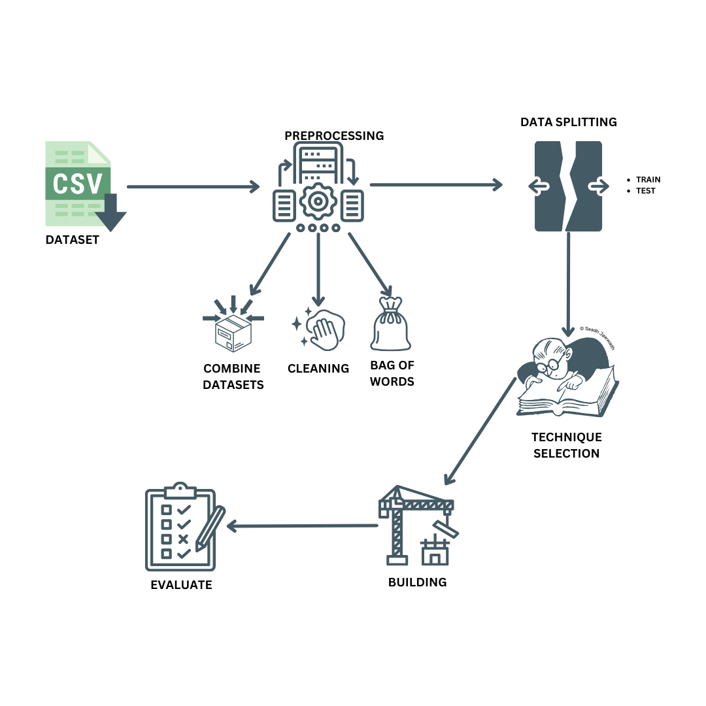

<h1 id="part-a-–-application-area-review">Application area review</h1>

Prior to the implementation I did a proper Literature review to acknowledge the
state of art techniques for detecting YouTube spam comments and ended up with
the following findings.

<table>
  <tr>
   <td><strong>Citation</strong>
   </td>
   <td><strong>Techniques</strong>
   </td>
  </tr>
  <tr>
   <td><a href="https://doi.org/10.1109/ICMLA.2015.37">(Alberto, Lochter and
Almeida, 2015)</a>
   </td>
   <td>NB, LR, KNN, RF
   </td>
  </tr>
  <tr>
   <td><a href="https://doi.org/10.1016/j.procs.2018.05.181">(Aiyar and Shetty,
2018)</a>
   </td>
   <td>N-Gram
   </td>
  </tr>
  <tr>
   <td><a href="https://doi.org/10.1109/ICACCI.2018.8554405">(Kanodia,
Sasheendran and Pathari, 2018)</a>
   </td>
   <td>Markov’s decision process
   </td>
  </tr>
  <tr>
   <td><a
href="https://www.irjet.net/archives/V7/i4/IRJET-V7I488.pdf">(Selvaraj, Konatham
and Anand, 2020)</a>
   </td>
   <td>LR
   </td>
  </tr>
  <tr>
   <td><a href="https://doi.org/10.1109/ACCESS.2021.3121508">(Oh, 2021)</a>
   </td>
   <td>Decision Tree, LR, NB, SVM
   </td>
  </tr>
  <tr>
   <td><a
href="https://www.semanticscholar.org/paper/A-COMPARATIVE-STUDY-ON-YOUTUBE-SPAM-COMMENT-USING-Ruth-Khan/644b2af51efb2ddbff0634af974b6c0d5abea30d">(Ruth,
Khan and Reddy, 2022)</a>
   </td>
   <td>RF, NB, SVM
   </td>
  </tr>
</table>

Even though techniques like Markov’s decision process and N-Gram have been
researched and used for this problem <em>(Aiyar and Shetty, 2018; Kanodia,
Sasheendran and Pathari, 2018)</em> classification methods like Naive Bayes
(NB), Random Forest (RF), Support Vector Machine (SVM), Logistic Regression
(LR), K-nearest Neighbors (KNN)  showed a promising results <em>(Alberto,
Lochter and Almeida, 2015; Kanodia, Sasheendran and Pathari, 2018; Selvaraj,
Konatham and Anand, 2020; Ruth, Khan and Reddy, 2022) </em>which clearly stated
that classification is the optimal technique to address this problem.

<h1 id="part-b-–-compare-and-evaluate-ai-techniques">Part B – Compare and
evaluate AI techniques.</h1>

Out of the above state of art techniques I have taken Random Forest (RF),
Logistic Regression (LR) and  Support Vector Machine (SVM) to compare and
evaluate.

<table>
  <tr>
   <td><strong>Algorithm</strong>
   </td>
   <td><strong>Strength</strong>
   </td>
   <td><strong>Weakness</strong>
   </td>
   <td><strong>Advantage</strong>
   </td>
   <td><strong>Disadvantage</strong>
   </td>
   <td><strong>Input</strong>
   </td>
   <td><strong>Output</strong>
   </td>
  </tr>
  <tr>
   <td>Random Forest (RF)
   </td>
   <td>Good performance on large datasets, handling missing data and high
dimensional spaces, ability to identify important features
   </td>
   <td>Computationally expensive, not suitable for real-time applications
   </td>
   <td>Ensemble method that improves overall performance, good for identifying
important features
   </td>
   <td>Computationally expensive, not suitable for real-time applications
   </td>
   <td>Numerical or categorical features
   </td>
   <td>Binary class label (spam or not spam)
   </td>
  </tr>
  <tr>
   <td>Logistic Regression (LR)
   </td>
   <td>Simple to implement, requires less computational resources, easily
interpretable
   </td>
   <td>Sensitive to outliers, not robust for non-linear problems
   </td>
   <td>Good for binary classification problems, easy to implement and interpret
   </td>
   <td>Sensitive to outliers, not robust for non-linear problems
   </td>
   <td>Numerical or categorical features
   </td>
   <td>Binary class label (spam or not spam)
   </td>
  </tr>
  <tr>
   <td>Support Vector Machine (SVM)
   </td>
   <td>Good for high dimensional spaces and non-linear problems
   </td>
   <td>Sensitive to choice of kernel, selection of parameters
   </td>
   <td>Good for classification and regression problems, useful when number of
features is greater than number of samples
   </td>
   <td>Sensitive to choice of kernel, selection of parameters
   </td>
   <td>Numerical or categorical features
   </td>
   <td>Class label, boundary that separates the two classes
   </td>
  </tr>
</table>

In the context of YouTube comment spam detection, RFs can be used to classify
comments as spam or not spam based on various features such as the text content,
user information, and comment history. LR can be used to predict the probability
of a comment being spam, based on a set of features, and SVM can be used to
build a model that separates spam comments from non-spam comments.

<h1 id="part-c-–-implementation">Part C – Implementation.</h1>
<h1>

</h1>
<h2 id="datasets">Datasets</h2>

This is a public set of comments collected for spam research. It has five
datasets composed of 1,956 real messages extracted from five videos that were
among the 10 most viewed on the collection period.

<table>
  <tr>
   <td><strong>Dataset </strong>
   </td>
   <td><strong>YouTube ID</strong>
   </td>
   <td><strong>Spam </strong>
   </td>
   <td><strong>Ham </strong>
   </td>
   <td><strong>Total</strong>
   </td>
  </tr>
  <tr>
   <td>Psy
   </td>
   <td>9bZkp7q19f0
   </td>
   <td>175
   </td>
   <td>175
   </td>
   <td>350
   </td>
  </tr>
  <tr>
   <td>KatyPerry
   </td>
   <td>9bZkp7q19f0
   </td>
   <td>175
   </td>
   <td>175
   </td>
   <td>350
   </td>
  </tr>
  <tr>
   <td>LMFAO
   </td>
   <td>KQ6zr6kCPj8
   </td>
   <td>236
   </td>
   <td>202
   </td>
   <td>438
   </td>
  </tr>
  <tr>
   <td>Eminem
   </td>
   <td>uelHwf8o7_U
   </td>
   <td>245
   </td>
   <td>203
   </td>
   <td>448
   </td>
  </tr>
  <tr>
   <td>Shakira
   </td>
   <td>pRpeEdMmmQ0
   </td>
   <td>174
   </td>
   <td>196
   </td>
   <td>370
   </td>
  </tr>
</table>

As you can see the data set is balanced in most cases yet you can find a clear
bar plot which shows the combined datasets balancing below.

Source: <a
href="https://archive.ics.uci.edu/ml/datasets/YouTube+Spam+Collection#">UCI
Machine Learning Repository: YouTube Spam Collection Data Set</a>

At last the confusion matrix has been used to define the performance of a classification algorithm. Each row of the matrix represents the instances in a predicted class, while each column represents the instances in an actual class (or vice versa). It also reflects a high matrix score <strong>mostly above 90</strong> and we can conclude that the <strong>model is optimal for this problem.</strong>

<em>Special thanks to UCI Machine Learning Repository for the dataset and other resources</em>

<em> © Saadh Jawwadh</em>

